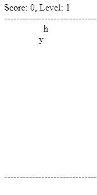

# RxJS Unit Testing

I'm newish to [RxJS](https://rxjs.dev/) and Reactive programming and so far haven't been impressed.
While sometimes I can solve problems elegantly, the times I've seen it deployed in JavaScript projects,
it's made things over complicated and opaque.
How can any library which with an API surface so large that it needs a
[decision tree](https://rxjs.dev/operator-decision-tree) be anything but?
In particular the unit testing story of RxJS concerned me; even some advocates tell me it's hard to do.

Given that it has a strong base of support, though, and that I see it more and more often on both the front and back end of project,
I wondered if, by dipping my toe in the water, I might change my mind?

I thought I'd tackle the unit testing problems first,
since I find unit tests to be a great way to explore and learn the features of a library like this
and in this post I'll introduce the basic toolsets included in the main project.
But to properly explore it, I also also wanted to see how those same tools fair when they encounter more realistic cases than are found in the documentation.
Without giving too much away, I was pleasantly surprised.

## Housekeeping

There's loads of great content out there introducing RxJS, so i'm not going to reinvent the wheel here.
Instead I recommend that if you're new to Reactive programming or RxJS head on over to their
[getting started page](https://rxjs.dev/guide/overview)
where you'll get a good overview.

I'm also going to use [Jest](https://jestjs.io/) to drive my tests, but, the concepts laid out here should apply equally in your framework of choice.
If you need an intro to Jest then again their [getting started page](https://jestjs.io/docs/getting-started) is a great place to start.

Everything here is written in [TypeScript](https://www.typescriptlang.org/),
I don't think i've used anything too out there though so hopefully it will still be clear if your only familiar with JavaScript.

If you would like to see the full listings from my investigation then you can find them on [github](https://github.com/jaybeeuu/rxjs-unit-testing).

## The tools

I want to stay lightish on this. It's a big topic and the interesting thing will be seeing this applied to a more complex case, but I do also want to introduce the main topics for RX testing. So bear with me.

The first topic to cover is the [`TestScheduler`](https://rxjs.dev/api/testing/TestScheduler).

RxJS, at it's heartm is a way to interact with and respond (or... if you will..._react_) to asynchronous events.
From a unit testing stand point that's a problem.
Asynchrony often means time delays, which means slow tests.
But it's also hard to document and visualise sequences of events in code, in a way that remains terse and expressive.
Enter the `TestScheduler`.

Rx operators take a [`SchedulerLike`](https://rxjs.dev/api/index/interface/SchedulerLike) argument which they will use to schedule their emissions and tasks.
Usually, by default they use the [`asyncScheduler`](https://rxjs.dev/api/index/const/asyncScheduler`) which puts an operators tasks on the event loop, so they happen asynchronously.
The `TestScheduler` by contrast runs tasks synchronously, and in a similar manner to jest's [Timer Mocks](https://jestjs.io/docs/timer-mocks), in "virtual time".

The virtual time bit of that is important to understand. Rather than using the systems clock and to schedule tasks the `TestScheduler` is maintaining an ordered list of tasks to run,
with a "time frame" associated with each one. Hopefully this will become clearer later...

For now, let's look at how to use one.
First we new it up, passing in a function we want it to use to make equality assertions.
This let's us customise it per test framework.
I'm going to package that up in a function so i don't have to repeat it for every test I write:

```ts
import { TestScheduler } from "rxjs/testing";

export const makeScheduler = (): TestScheduler => new TestScheduler((actual, expected) => {
  expect(actual).toStrictEqual(expected);
});
```

The main method we're going to be interested on in the `TestScheduler` instance is [`run`](https://rxjs.dev/api/testing/TestScheduler#run). That is where the body of our test will be, and gives us some tools for building the tests.

## The Simple Case

Here's a simple test case so we have something to talk about.

```ts
describe("delay", () => {
  it("delays each emission.", () => {
    makeScheduler().run(({ cold, expectObservable }) => {
      const source = cold("1-2-3|");
      const expected = "   300ms 1-2-(3|)";
      expectObservable(source.pipe(
        delay(300)
      )).toBe(expected);
    });
  });
});
```

So skipping the Jest `describe` and `it`, line 3 makes the scheduler (using the function I showed before), the calls `run`.
The callback I'm passing in contains the body of the test, and you can see that i'm destructuring some properties from the
[RunHelpers](https://rxjs.dev/api/testing/RunHelpers#runhelpers)
argument I'm passed.
[`cold`](https://rxjs.dev/api/testing/TestScheduler#createcoldobservable)
and
[`expectObservable`](https://rxjs.dev/api/testing/TestScheduler#expectobservable)
.

`cold` lets me create a cold observable (as opposed to a
[`hot` observable](https://benlesh.medium.com/hot-vs-cold-observables-f8094ed53339)
) using marble syntax, that's what you see on line 4: `"1-2-3|"`.
(Often [documentation](https://rxmarbles.com/)) for RxJS appears to revolve around marble diagrams
and studies show no Rxer can go more than 4 minutes without drawing drawing one.)
This is a DSL (Domain specific language) which let's us concisely describe the behaviour of the observable.
Each character is meaningful.
In this case, it will in sequence:

1. `1` - emit the string value `"1"`
2. "-" - wait a frame (by default 1 frame === 1ms)
3. `2` - emit the string value `"2"`
4. `-` - wait a frame
5. `3` - emit the string value `"3"`
6. `|` - complete.

RxJS have a
[full listing of the syntax](https://rxjs.dev/guide/testing/marble-testing#marble-syntax)
on their website so I won't repeat it here.

I actually think this is pretty cool.
It let's us have fine grained control over when in (virtual) time the emissions occur.
And is also used in the assertions.

That's Line 5, we're defining what we expect to happen.

1. `` - white space, which is ignored, to align the diagrams
2. `300ms` - Wait 300 milliseconds (In virtual time - Jest tells me this test only takes a few milliseconds to run).
3. `1` - emit the string value `"1"`
4. "-" - wait a frame
5. `2` - emit the string value `"2"`
6. `-` - wait a frame
7. `3` - emit the string value `"3"`
8. `|` - complete.

Line 6 and we're done. I'm defining the pipeline I want to test. In this case, there's a single operator -
[`delay`](https://rxjs.dev/api/operators/delay)
.
I've inlined that into my call to `expectObservable` and then called `.toBe` which takes my expected Marble diagram and performs the equality assertion on it.

Easy.
Too easy?
When I first saw this I wondered if it wasn't a bit gimmicky.
It seems like it might be too simple to scale to more complex scenarios.
But apparently the Rx team use this internally to test all of the 300,000 operators in the library
and eventually decided to officially support it.
A bit of archeology indicates that it was added in what became
[version 5](https://github.com/ReactiveX/rxjs/commit/b23daf14769d1efc2f27901fed27d334a465153d)
.

The syntax seems at first glance to be a bit limited, only allowing the emissions to be single character strings,
but the methods and functions accepting them also accept a second argument,
letting you map to more complex objects... promising.

## Getting more complex

To turn my head, I really need to take this for a test drive with a more complex case.
Rather than write my own thing to unit test,
I used the
[alphabet-invasion-game](https://www.learnrxjs.io/learn-rxjs/recipes/alphabet-invasion-game)
(
props to [adamlubek](https://github.com/adamlubek)
) as the base for my more complex case.

This is a simple game.
Letters march down the screen, press the key of the lowest letter to make it disappear and score a point.
The game ends when a letter reaches the bottom.
Every 20 points increases the rate at which the letters march.

Here's a gif of my embarrassingly bad touch typing:



With, purposefully, only a few minor refactors, to get it into a unit testable state
and to avoid some of the more obscure syntax the author favored (TIL - the
[comma operator](https://developer.mozilla.org/en-US/docs/Web/JavaScript/Reference/Operators/Comma_Operator)
)
.
You can see the full listings of my refactor on [github](https://github.com/jaybeeuu/rxjs-unit-testing/blob/main/src/alphabet-invasion/alphabet-invasion.ts).
But it's made up of 3 basic components.

First up the letters:

```ts
export interface Letter {
  letter: string;
  yPos: number;
}

export interface Letters {
  letters: Letter[];
  interval: number;
}

const intervalSubject = new BehaviorSubject(600);

const letterState$ = intervalSubject.pipe(
  switchMap((i) => interval(i)
    .pipe(
      scan<number, Letters>((letters) => ({
        interval: i,
        letters: [
          {
            letter: randomLetter(),
            yPos: randomInt({ max: gameWidth })
          },
          ...letters.letters
        ]
      }), { letters: [], interval: 0 })
    )));
```

Here we're defining the state of the letters in the game field; here's the highlights...

* `intervalSubject` - defines the number of milliseconds between letters being added. It's a
[`BehaviourSubject`](https://rxjs.dev/api/index/class/BehaviorSubject)
so that when we change level we can `next` in a new delay.
* `letterState` - ses
[`switchMap`](https://rxjs.dev/api/operators/switchMap)
and
[`scan`](https://rxjs.dev/api/operators/scan)
to make an observable list of letters which adds a new, random, letter (definitions of
[`randomLetter`](https://github.com/jaybeeuu/rxjs-unit-testing/blob/main/src/alphabet-invasion/random.ts#L8')
and
[`randomInt`](https://github.com/jaybeeuu/rxjs-unit-testing/blob/main/src/alphabet-invasion/random.ts#L1')
if you are curious) every `n` milliseconds, where `n` is the number last emitted from the `intervalSubject`,

The next bit

```ts
const key$ = fromEvent<KeyboardEvent>(
  document,
  "keydown"
).pipe(
  map((e: { key: string }) => e.key),
  startWith("")
);
```

Uses
[`fromEvent`](https://rxjs.dev/api/index/function/fromEvent)
to subscribe to the document's `keydown` event and
[map](https://rxjs.dev/api/operators/map)
s because we're only interested in which character the key pressed represents.
We [startWith](https://rxjs.dev/api/index/function/startWith) so that we get an emission as soon as we subscribe, rater than waiting for the first keystroke.

Finallly

## References

* [marble-testing](https://rxjs.dev/guide/testing/marble-testing)
* [alphabet invasion](https://www.learnrxjs.io/learn-rxjs/recipes/alphabet-invasion-game)
* [alphabet invasion stackblitz](https://stackblitz.com/edit/rxjs-alphabet-invasion?file=index.ts)
